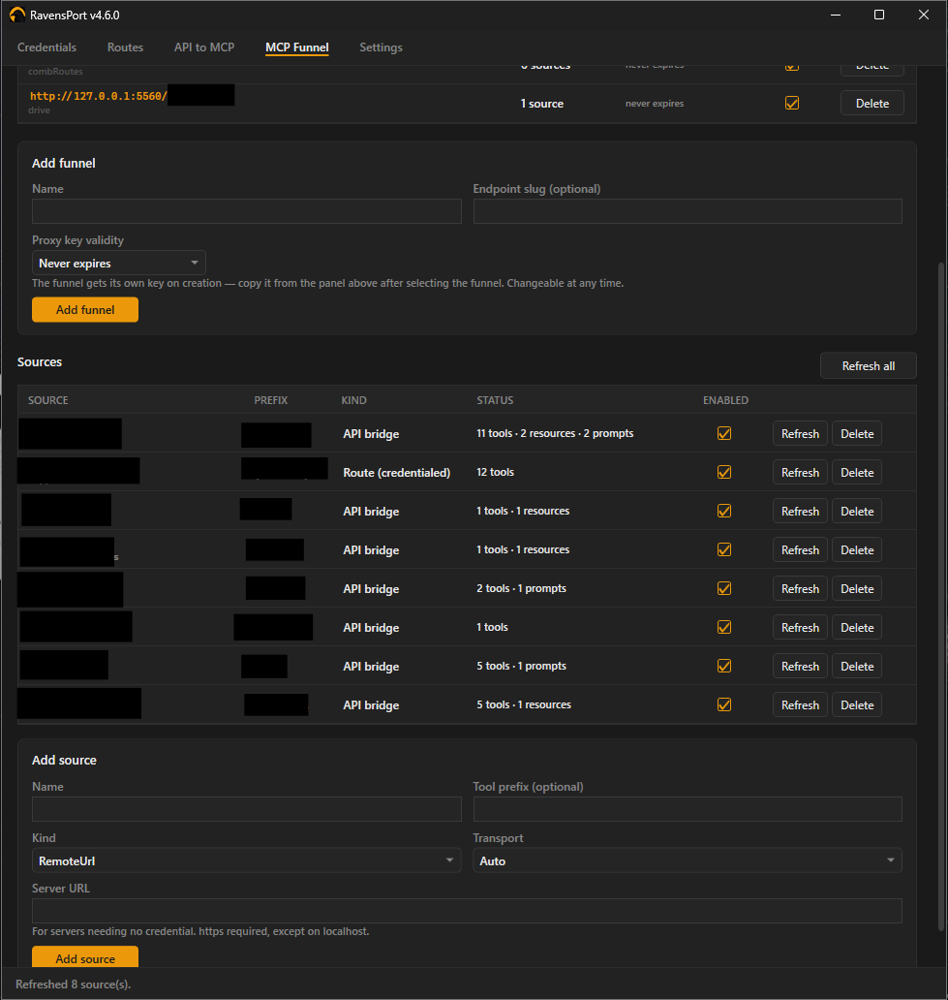
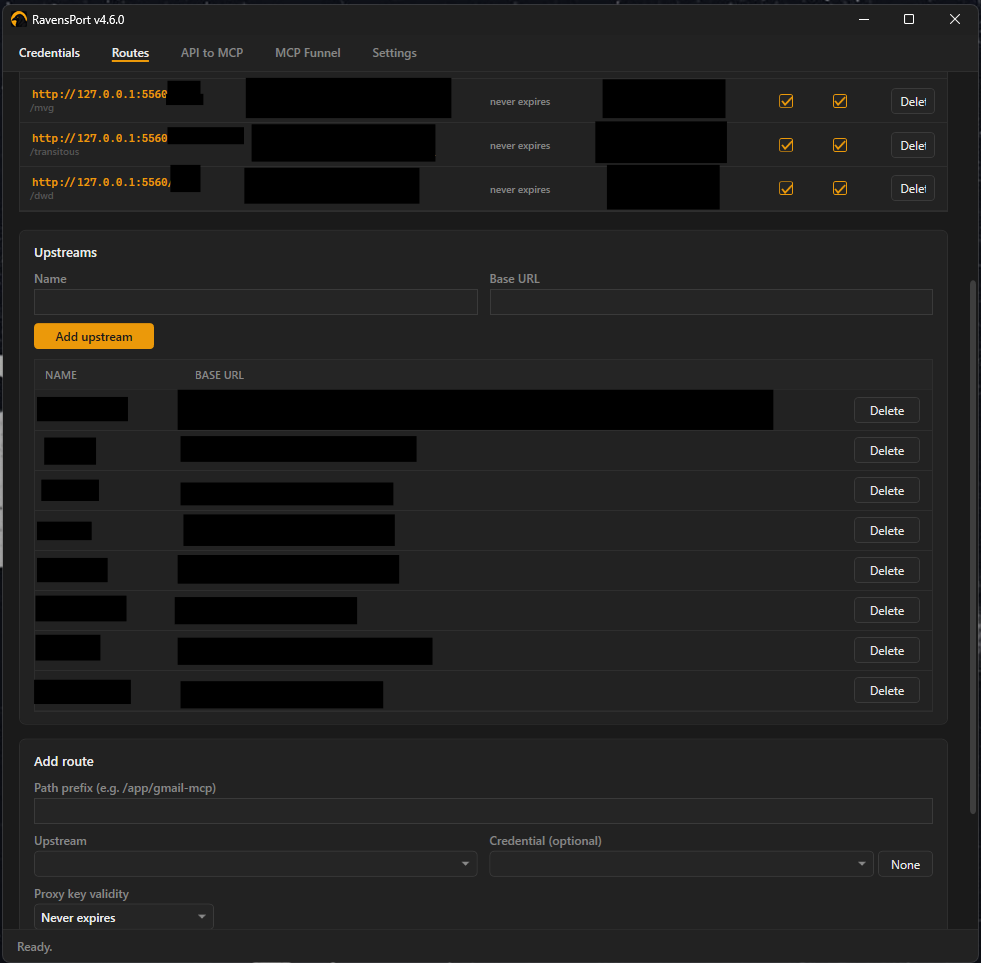
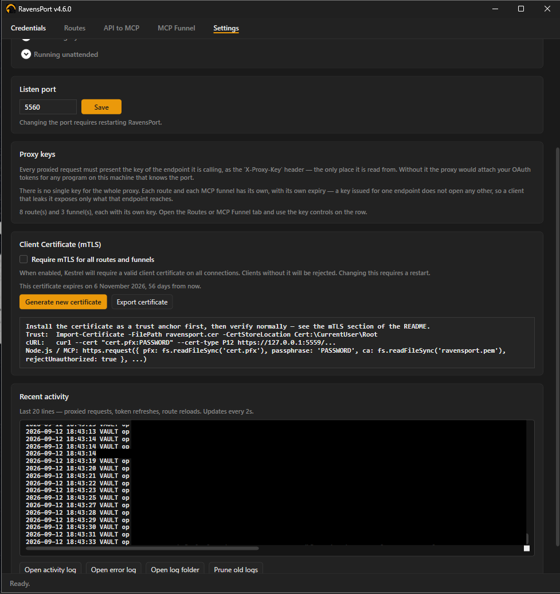
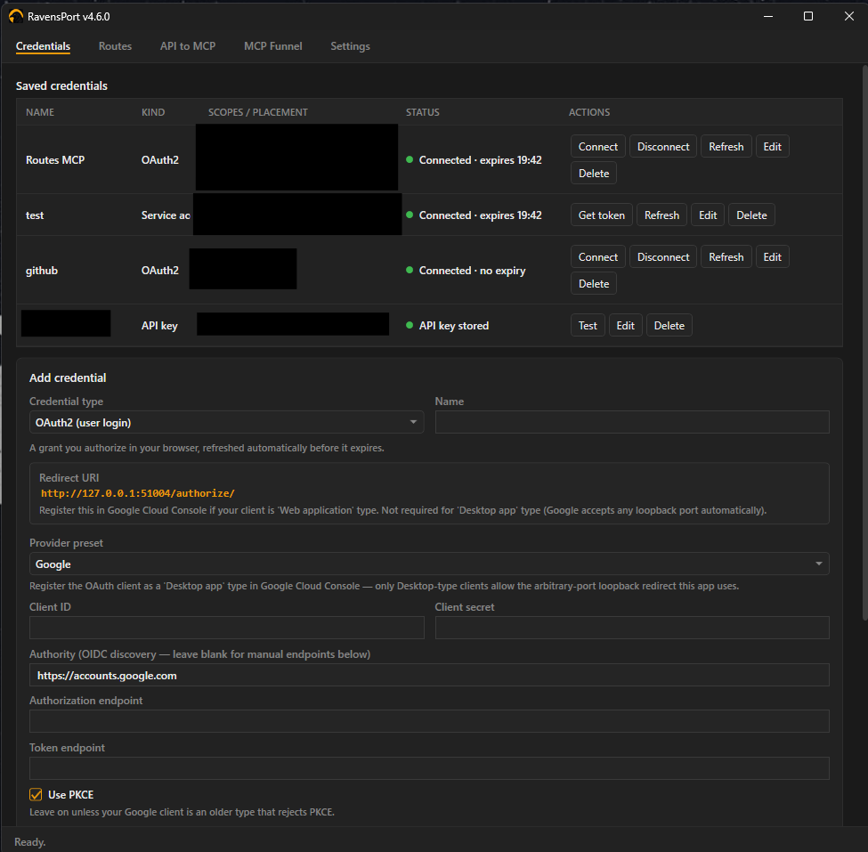

<p align="center">
  
</p>

<h1 align="center">RavensPort</h1>

<p align="center">
  <b>Give each AI agent its own MCP endpoint — pooling the servers you choose, exposing only the
  tools you allow, with OAuth handled for you.</b>
</p>

A tray-resident Windows app that runs a local reverse proxy on `127.0.0.1`. It owns the OAuth2
flow and token lifecycle for upstream APIs and MCP servers, then lets you compose those servers
into filtered, per-agent MCP endpoints.

[](media/mcpFunnelScreen.png)

---

> ### Upgrading from a version before 2.0?
>
> **This version does not read your old configuration.** Secrets have moved out of the encrypted
> `store.dat` file and into a vault in your password manager, and there is no import path.
> Credentials, upstreams, routes, MCP sources and funnels all need to be set up again, and every
> client needs to be handed the new key for the endpoint it calls.
>
> The old `%AppData%\RavensPort\store.dat` is left where it is — RavensPort never reads or
> deletes it, and the setup page offers to delete it once you are done with it.
>
> You will need **1Password** or **Proton Pass** installed and unlocked — or, for 1Password, a
> service account token, which needs nothing installed at all. See
> [Where your configuration lives](#where-your-configuration-lives).

---

## The problem

MCP servers are increasingly behind OAuth2, but most MCP clients expect a bare HTTP endpoint with
no auth story. And once you have three servers connected, your agent sees *all* of their tools —
ninety of them — with no way to say "this agent gets these six."

RavensPort solves both halves:

| | |
|---|---|
| **Routes** | Attach a live OAuth token to every request forwarded to an upstream. Your client never handles auth. |
| **Funnels** | Pool several MCP servers behind one local endpoint and expose only the tools, resources, and prompts you pick. |

The result: point each agent at `http://127.0.0.1:5559/mcp/<name>` and it sees exactly the
toolset you granted it, drawn from as many upstreams as you like — including ones it could never
reach on its own.

## Features

- **MCP Funnel** — per-agent endpoints pooling multiple MCP servers with per-tool filtering
- **Multi-provider OAuth2** — Google (via `Google.Apis.Auth`), Nextcloud, or any custom OAuth2
  provider (via `IdentityModel.OidcClient`; plain OAuth2, no OIDC discovery required)
- **Static API keys** — for the many services that never offered OAuth; attach to routes exactly
  like a token, with an optional **Test** button that checks the key against a real endpoint
- **Flexible credential placement** — `Authorization: Bearer <token>` by default, or any header,
  query parameter, or request-body field, with a custom value prefix
- **Any number of credentials per route** — none, one, or several at once, in any mix of headers,
  query parameters, and body fields; the same credential may appear in more than one place
- **Automatic token refresh** — 10 minutes ahead of expiry, in the background
- **Any credential backs any route** — not a fixed 1:1 mapping
- **Stored in your password manager** — 1Password or Proton Pass holds every secret; nothing is written to this PC
- **1Password without the desktop app** — sign in with a service account token instead, so nothing
  local has to be installed, running, or unlocked; the token is kept only in memory unless you ask
  for it to be saved behind Windows Hello
- **A proxy key per endpoint** — every route and every funnel has its own, with its own expiry, so
  other processes on your machine cannot spend your grants and a key leaked from one client cannot
  reach the rest
- **Client certificates (mTLS)** — optionally require a certificate on every connection as well as
  the key, so a process that reads a key out of a config file still cannot call the proxy
- **Activity log** with redaction and rotation, viewable in-app
- **Tray-resident** — starts hidden, survives provider and network errors, single-instance guard
- **CI-published releases** with build provenance attestation

## Requirements

- Windows 10/11
- [.NET 8 SDK](https://dotnet.microsoft.com/download/dotnet/8.0) or newer — only to build from
  source; released binaries are self-contained

## Install

### From a release

Download `RavensPort-Setup-<version>.exe` from the [Releases page](../../releases) and run it. It
installs per-user — no elevation prompt, no .NET install, no extraction — and leaves a Start menu
shortcut and an Add or Remove Programs entry behind.

Windows will warn about an unknown publisher — the installer is not Authenticode-signed. Instead
every release carries a **build provenance attestation** recording the workflow, commit, and
runner that produced it. Verify with the [GitHub CLI](https://cli.github.com/):

```bash
gh attestation verify RavensPort-Setup-<version>.exe --repo abishekvupputur/ravensPort
```

A pass means the file is byte-for-byte what CI built from this repository.

### From source

```
clean-build.bat
```

Stops any running instance, wipes `bin`/`obj`, rebuilds, and launches. Look for the padlock in
the system tray — left-click opens the window, right-click gives a menu.

The proxy listens on **`http://127.0.0.1:5559`** by default (changeable in Settings; requires a
restart).

---

## Concepts

Four things, each built on the last:

```
Credential  →  an OAuth2 grant you have connected, or a static API key you pasted in
Upstream    →  a base URL to forward to
Route       →  a local path prefix that forwards to an upstream, attaching any number of credentials
Funnel      →  a local MCP endpoint pooling several MCP servers, filtered per agent
```

You need a credential and a route to reach a protected API. You need a funnel only if you want to
shape what an agent sees.

---

## Setting up a credential

Pick a **Credential type** first — it decides the rest of the form.

| Type | For | Needs |
|---|---|---|
| **OAuth2** | Google, Nextcloud, any OAuth2 provider | client ID/secret, scopes, a browser consent flow |
| **API key** | services that never offered OAuth | the key, and where it goes |

Both kinds attach to routes identically, and both share two fields:

- **Default placement** — where the secret goes by default. Used by the Test button, and it
  prefills the entry when you attach this credential to a route (a route can still override it).
  OAuth2 defaults to `Authorization: Bearer <token>`; API key defaults to `X-Api-Key: <key>`.
- **Test endpoint** (optional) — see [Testing a credential](#testing-a-credential).

### API key

**Credentials tab** → set type to **API key** → name it → paste the key → **Add credential**.

- Set the placement to whatever the service documents — `X-Api-Key`, `PRIVATE-TOKEN`,
  `?api_key=`, `Authorization` with a `token ` prefix, or a body field.
- The key is stored in your password manager with everything else and is **never redisplayed**. On
  edit, a blank key box means "keep the current key", exactly as for a client secret.
- Keys containing control characters (a line break picked up when copying out of a wrapped email,
  say) are **rejected**. Written into a header, a CR or LF ends the header line and lets the rest
  be read as further headers — request splitting, aimed at your upstream. The forwarder refuses
  such a value too, in case one reached the store some other way.
- There is nothing to connect, expire, or refresh, so an API-key credential shows **Connect /
  Disconnect / Refresh** nowhere. Its status is simply whether a key is stored.

### Google

1. In [Google Cloud Console](https://console.cloud.google.com/), create an OAuth client.
   - **Desktop app** is easiest — Google accepts any loopback port, nothing to register.
   - For **Web application**, register the exact redirect URI shown in the Credentials tab
     (`http://127.0.0.1:51004/authorize/`).
2. Paste Client ID/Secret, set scopes, **Connect**.

Every Google authorization forces the consent screen (`prompt=consent`) so a refresh token is
issued every time — otherwise the credential silently cannot auto-refresh later.

[](media/oAuthLoginSuccess.png)

### Nextcloud or custom OAuth2

1. Create an OAuth2 client under **Nextcloud Settings → Security → OAuth2**, or your provider's
   equivalent.
2. Pick the **Nextcloud** or **Custom** preset. Fill in the Authorization and Token endpoints (or
   an Authority for OIDC discovery), Client ID/Secret, and scopes.
3. Register `http://127.0.0.1:51005/callback/` as the redirect URI if your provider requires
   pre-registration. It is fixed and copyable from the UI.

Endpoints must be `https`, except on localhost — these fields receive your client secret and
refresh token.

### Testing a credential

Set a **Test endpoint** — any URL that answers `200` to an authenticated `GET` — and the
credential's row gains a **Test** button. Clicking it sends one GET there with the credential
attached in its default placement, and reports what came back.

This matters most for API keys. An OAuth grant proves itself during the browser flow — a wrong
client secret cannot complete one — but nothing validates a pasted key, so without this the first
sign of a typo is a `401` on a real request hours later, which reads as an upstream problem
rather than a credential one.

| Result | Means |
|---|---|
| `200` | The credential works, in that placement, at that endpoint. |
| `401` / `403` | The secret, or where it is placed, is wrong. |
| `3xx` | Almost certainly a redirect to a sign-in page. |
| `404` | Check the test endpoint URL itself, not the credential. |
| unreachable / timeout | Says nothing about the credential. |

- **Only `200` passes**, and **redirects are not followed** — following one would report a login
  page as proof the credential works, which is exactly the failure being tested for.
- A **body** default placement cannot be tested: the request is a GET and has no body. Set the
  default placement to a header or query parameter to test, then override it on the route.
- The endpoint must be `https` (or localhost) — the secret is sent there. Neither the result
  message nor the activity log ever contains the secret or the query string it might sit in.

---

## Setting up a route

**Routes tab** → add an **Upstream** (name + base URL) → enter a **path prefix**, pick the
upstream and (optionally) a credential → **Add route**.

[](media/routesScreen.png)

- **Strip prefix** (on by default): `/app/my-service/foo` forwards upstream as `/foo` — the prefix
  is just a local label. Turn it off only if the upstream expects that prefix in its own path.
- The full local endpoint is shown ready to paste into a client config.
- Routes can be disabled without deleting them.
- Prefixes must be unique, and `/mcp` is reserved for funnel endpoints.
- Upstream base URLs must be `https` except on localhost — the access token goes to every request
  forwarded there.

### How the credential is sent

By default the token goes out as `Authorization: Bearer <token>`. For upstreams that want it
elsewhere, each credential on a route has a **placement**, a **name**, and a **value prefix**:

| Placement | Name means | Result |
|---|---|---|
| **Header** (default) | header name | `Authorization: Bearer <token>` or `X-Api-Key: <token>` |
| **Query** | query parameter name | `?access_token=<token>` |
| **Body** | field in the request body | `{"access_token": "<token>"}` |

- The value prefix is literal text before the token — `Bearer ` **including the trailing space**.
  Leave it empty for a bare token.
- A caller-supplied header, parameter, or field of the same name is **replaced**, never
  duplicated, so the upstream never sees two candidate credentials.
- Body injection applies to JSON objects and `application/x-www-form-urlencoded` bodies up to
  1 MB, including chunked and streamed ones. Anything larger or in another content type is
  forwarded untouched and the activity log says why.
- Names the proxy owns are rejected: `Host`, `Content-Length`, `Transfer-Encoding`, `Connection`,
  `Upgrade` as headers, and `proxy_key` as a query parameter.

### Zero, one, or several credentials per route

Select a route in the grid to open its editor — the route's own proxy key sits at the top, the
credentials below it. **Add credential** appends another
entry; **Remove** drops one. Every entry has its own credential, placement, name, and prefix, so a
route can carry any combination:

| Route attaches | Example |
|---|---|
| Nothing | plain forwarding hop to an upstream that needs no token |
| One credential | `Authorization: Bearer <token>` — the usual case |
| Two query parameters | `?access_token=<A>&api_key=<B>` |
| Two or more headers | `Authorization: Bearer <A>` + `X-Project-Key: <B>` |
| Query + header | `?access_token=<A>` + `X-Api-Key: <B>` |
| Query + several headers | `?access_token=<A>` + `Authorization: Bearer <A>` + `X-Api-Key: <B>` + `PRIVATE-TOKEN: token <B>` |
| Header + query + body | all three at once, from the same or different credentials |
| Several body fields | `{"access_token": "<A>", "project_token": "<B>"}` — written in one rewrite |
| OAuth token + API key | `Authorization: Bearer <token>` + `X-Api-Key: <key>` — a user grant plus a project key, which plenty of APIs demand together |

- Entries are independent: two **different** credentials side by side, or the **same** credential
  in two places (some APIs want the token in a header for auth and echoed in the body for audit).
  OAuth2 and API-key credentials mix freely on one route.
- Adding a credential to a route prefills from that credential's **default placement**, so an
  `X-Api-Key` credential arrives already described as one.
- **A route with no credential still forwards**, and still strips the caller's own `Authorization`
  header and cookies. Attaching nothing is not a licence to relay whatever the caller sent — that
  guarantee holds on every route, and the route's own proxy key is still required.
- **No two entries may write the same slot.** Two credentials on one header, query parameter, or
  body field would silently overwrite each other, so the pair is refused at the point of editing.
  Header names are compared case-insensitively (HTTP treats them that way); query parameter and
  body field names are case-sensitive.
- A credential you delete stops being attached on the routes that referenced it — **the other
  credentials on those routes keep working**. The row shows `⚠ credential missing`.
- If a request cannot carry a body placement (a `GET`, or a body this cannot parse), that entry is
  skipped and the header and query entries on the same route still arrive. The activity log names
  every credential that was attached and every one that was not.
- Routes created by older versions carry their single credential over unchanged on first load.

---

## MCP Funnel

A funnel is a local MCP endpoint at `http://127.0.0.1:5559/mcp/<slug>` that pools several MCP
servers and exposes a subset of what they offer. Point one funnel at each agent.

Off by default — enable it with **Enable MCP funnel** on the MCP Funnel tab. While off, every path
under `/mcp` returns `404`.

### 1. Add sources

A **source** is one MCP server the funnel can draw from:

| Kind | What it is |
|---|---|
| **Route (credentialed)** | An MCP server reached through one of your routes. The OAuth token is attached automatically. |
| **URL (no auth)** | Any MCP server needing no credential. |

Press **Refresh** on a source to connect and read what it offers. The status column reports the
result, or the reason it could not be reached.

### 2. Create a funnel

Give it a name and an endpoint slug. The full URL appears in the grid, selectable and ready to
paste.

### 3. Choose what it exposes

Select the funnel, tick the sources it pools, then per source and per kind (tools, resources,
prompts):

| Mode | Behaviour |
|---|---|
| **All** | Everything, including whatever the server gains later. |
| **Include** | Only what is ticked. A tool added upstream later stays hidden until you pick it. |
| **Exclude** | Everything except what is ticked. A tool added later is exposed immediately. |

Use **Include** to grant a known set, **Exclude** to revoke a few from an otherwise trusted
server.

Edits apply on the agent's **next call** — no reconnect, no restart.

### Tool naming

Every name is prefixed with its source's alias: `create_issue` from a source aliased `gh` reaches
the agent as `gh__create_issue`. Resources are rewritten to `funnel://gh/<original-uri>` and
mapped back on read.

Prefixing is unconditional by design. Prefixing only on collision would rename a tool the day you
add an unrelated source, breaking every agent prompt that referenced it.

### Pointing an agent at a funnel

```jsonc
{
  "servers": {
    "my-agent": {
      "url": "http://127.0.0.1:5559/mcp/my-agent?proxy_key=<this-funnel's-key>"
    }
  }
}
```

Each funnel has **its own** proxy key — no route's key opens it, and no other funnel's does.
Select the funnel to copy its key, or the whole URL with the key already attached.

Or send the key as the `X-Proxy-Key` header if your client supports custom headers.

### Behaviour

- **Endpoints are independent.** Two funnels drawing on the same upstream hold separate MCP
  sessions, so one agent cannot perturb another and one expired session cannot take both down.
- **Calls run in parallel**, across endpoints and within one.
- **A dead source degrades only itself** — the healthy sources still list, and the failure is
  shown on that source's row and in the log.
- **Filtering is enforced on the call path**, not just the listing. A tool an agent learned before
  you unticked it is refused, and the call never reaches the upstream.
- **Arguments are never logged.** Tool names and outcomes are; the values an agent passes are not.
- `/mcp` is reserved, and a request that already passed through a funnel is refused rather than
  allowed to loop.

### Limits

- Sources must be HTTP MCP servers. Local **stdio** servers (`npx …`) are not supported.
- Sampling, elicitation, and resource subscriptions are not offered on a funnel endpoint — it runs
  stateless, which is what makes edits take effect on the next call.
- Two agents on the *same* funnel share its upstream sessions. Give each agent its own funnel if
  they must be isolated.
- A route-backed source that keys sessions on a **cookie** rather than the standard
  `Mcp-Session-Id` header cannot hold a session: `Cookie` is stripped on the way upstream,
  deliberately, so a caller cannot launder its own credentials through the proxy.

---

## Calling the proxy

Every request — routes and funnels alike — must present **the proxy key of the endpoint it is
calling**. There is no key for the proxy as a whole: each route carries its own, each funnel
carries its own, and a key opens nothing but the endpoint it was issued for.

Copy a route's key from its row on the **Routes** tab (select the route to open its editor), and a
funnel's from the panel under the **MCP Funnel** tab.

```bash
curl -H "X-Proxy-Key: <this-route's-key>" http://127.0.0.1:5559/app/my-service/foo
```

For clients that cannot set headers (browser `EventSource`, some MCP SSE transports), pass it as a
query parameter instead:

```
http://127.0.0.1:5559/app/my-service?token=abc&proxy_key=<this-route's-key>
```

The key is stripped before forwarding — in both forms — so it never reaches the upstream's access
log or this app's activity log. Your own headers and parameters pass through untouched.

Anything without a valid key gets `403`: a wrong key, another endpoint's key, an expired key, and
a path belonging to no route or funnel all answer the same way, so the reply cannot be used to map
which endpoints exist.

The key can be backed by a client certificate as well — see
[Client certificates (mTLS)](#client-certificates-mtls-new-in-420).

### Key validity

Each key is generated when its route or funnel is created and is valid **until you replace it**
unless you say otherwise. **Valid for** on the row sets a lifetime — 1 or 4 hours, or 1, 7, 30, 90,
or 360 days — always measured from the moment the key was last generated, never from when you
picked it. Changing the setting therefore re-describes how long this secret was ever meant to live
rather than granting it more time: dropping a month-old key to "1 hour" ends it now. Once it lapses
the endpoint answers `403`; the row says so in red, and so does the log.

**Regenerate** issues a new key for that one endpoint, immediately, and is the only thing that
restarts the clock — at whatever lifetime is currently selected. Clients still holding the old key
get `403`; every other endpoint is untouched. It is also the way back from an expired key.

> **Upgrading from a build with a single proxy-wide key:** that key is no longer read. Every
> existing route and funnel is issued its own on first launch, so each client has to be given the
> key of the endpoint it calls.

Use **Regenerate** if a key is ever exposed; clients using the old key start getting
`403` immediately.

### Why the key exists, and why there is one per endpoint

Binding to `127.0.0.1` keeps other machines out, but it is **not** an authorization boundary:
every process on your computer, under any account, can reach loopback. Since the proxy attaches
your live OAuth token to whatever it forwards, an unguarded listener would hand your Google or
Nextcloud session to any local program that knew the port.

One key for the whole proxy made every client that held it a client of **every** route: an agent
given the key so it could reach a calendar endpoint could equally spend the grant attached to a
mail endpoint, and revoking one client meant re-keying all of them. Per-endpoint keys make the
blast radius of a leaked key exactly the endpoint it was issued for, and revocation a one-row
operation. It is also what makes a funnel meaningful — an agent handed a funnel's key sees the
tools that funnel exposes and cannot reach the routes underneath it directly.

The key also blocks **DNS rebinding**, where a page on an attacker's domain re-resolves that name
to `127.0.0.1` so the browser treats proxied responses as same-origin and lets its JavaScript read
them.

Alongside the key, the proxy refuses requests whose `Host` is not loopback, refuses requests
carrying an `Origin` header (only browsers send one), and strips `Access-Control-*` headers from
upstream responses so a permissive upstream cannot reopen the same hole.

---

## Client certificates (mTLS) <sub><sup>new in 4.2.0</sup></sub>

Optional, off by default. Turn on **Require mTLS for all routes and funnels** on the Settings tab
and the proxy switches from `http://127.0.0.1:5559` to **`https://127.0.0.1:5559`** and demands a
client certificate on every connection — routes, funnels, everything.

This is a second factor for the same door, not a replacement for the proxy key. A key sits in
whatever config file the client reads it from, so any process that can read that file can spend it;
a certificate has to be installed as well, and both are checked. Every request still needs the key
of the endpoint it is calling.

**Changing the setting requires a full restart of RavensPort.** The listener's scheme and its
certificate demand are fixed when Kestrel binds, so nothing about this takes effect until the app
is restarted — the Settings tab says so in red until it is.

### Generating and exporting

**Generate new certificate** asks for a password, then mints a self-signed certificate. RavensPort
keeps it in the vault with everything else and presents it at both ends: the listener serves it and
demands it back, and the funnel presents it when it dials this app's own routes.

- **You choose the password, and it is shown nowhere afterwards** — not on the status line, not in
  the log. Write it down before confirming. There is no way to recover it; the way out of a
  forgotten one is generating another certificate and reinstalling it everywhere.
- **Export certificate** asks where to save the `.pfx`. That file *is* the credential — whoever
  holds it can call the proxy — so put it where the client that needs it can read it, and nowhere
  else. The password stops Windows and curl refusing a password-less PFX; it does not make a copy
  of the file safe to leave lying around.
- **Generating a new certificate invalidates the old one immediately.** Every client holding the
  previous file is refused. Export the new one, install it everywhere it is used, and restart.

### Pointing a client at it

```bash
curl -k --cert "cert.pfx:<your-password>" --cert-type P12 \
     -H "X-Proxy-Key: <this-route's-key>" \
     https://127.0.0.1:5559/app/my-service/foo
```

```jsonc
https.request({
  pfx: fs.readFileSync('cert.pfx'),
  passphrase: '<your-password>',
  rejectUnauthorized: false
}, ...)
```

`-k` / `rejectUnauthorized: false` are there because the certificate is self-signed and no
machine trusts it. That switches off the client's verification of the *server*, not the server's
demand for a certificate from the *client* — which is the direction that matters here. RavensPort
does not skip anything: it compares the thumbprint of what it was handed against its own.

### Expiry

Certificates are minted with a **90-day** life. Nothing renews them, and there is no CA behind
them — no revocation list to publish, no way to recall a copy that leaked — so the expiry date is
the only thing that retires one.

It is enforced, at both ends. Past the date the proxy refuses the certificate it issued, including
its own funnel's hop into its own routes. **An expired certificate fails during the TLS handshake,
so clients see a dropped connection rather than a status code** — there is no `403` to read, which
is why the date is worth watching.

The Settings tab shows when the current certificate expires, and says so in red once it is within
14 days. Rotating means generating, exporting, installing on every client, and restarting, so it
is not something to start on the day it stops working.

---

## Settings and diagnostics

[](media/settingsScreen.png)

**Autostart** — Settings tab → **Start with Windows**. Writes an `HKCU\...\Run` entry pointing at
the current exe. Never set automatically.

**Credentials** — Connect, Refresh, Disconnect (clears the local token without revoking the grant
at the provider), Test, Edit, Delete. A colored dot and expiry time refresh every 15 seconds.
Connect/Refresh/Disconnect appear only for OAuth2 credentials — an API key has nothing to
authorize and nothing to refresh. Test appears only once a test endpoint is set.

[](media/credentialsScreen.png)

---

## Where your configuration lives

Everything — OAuth client secrets, access and refresh tokens, API keys, per-endpoint proxy keys,
routes, upstreams, MCP sources and funnels, and settings — is stored in a vault called
**`RavensPort`** in your password manager. **None of it is kept on this PC.** There is no local
cache and no fallback file, so the proxy does not start until the vault is reachable — 1Password or
Proton Pass unlocked, or a 1Password service account token entered, which needs nothing local
unlocked at all. (RavensPort does write logs, and — if you sign in to Proton Pass from inside the
app, or ask it to remember a 1Password service account token — its own encrypted credential for
that sign-in. Neither contains any of the above. See [Logs](#logs).)

### Supported managers

| Manager | Client | Install |
| --- | --- | --- |
| 1Password | [Native SDK (embedded)](https://github.com/1Password/onepassword-sdk-go), or `op.exe` when a service account token is used and the CLI is installed | `winget install AgileBits.1Password` (desktop app required for that mode) — or a **service account token**, which needs nothing installed |
| Proton Pass | `pass-cli` | `winget install Proton.PassCLI`, or let RavensPort fetch it — the setup page offers **Download it for me** |

Open RavensPort and it walks you through the rest: install, sign in, and set up a vault. It only
ever touches items it created, so the vault stays safe to keep other things in.

[](media/setupPage.png)


**Signing in — 1Password.** There are two ways in, picked on the setup card. Which one you want is
a decision about the machine, so RavensPort asks rather than guessing.

**1. Desktop app integration.** In the 1Password desktop app, navigate to **Settings → Developer**
and enable the **[1Password SDK](https://github.com/1Password/onepassword-sdk-go)**, then enter your
account name — the exact name at the top of the 1Password sidebar, such as `Personal`.

[](media/onePasswordEnableSDK.png)

When RavensPort first tries to access your vault, 1Password will show a consent screen:

[](media/onePasswordConsentScreen.png)

This mode needs 1Password running and unlocked, and it carries a known defect on 1Password's side
([ipc-client#9](https://github.com/1Password/onepassword-ipc-client/issues/9)): if 1Password starts
while RavensPort is already running, it never opens its integration channel, silently, for the life
of that 1Password process. Restarting 1Password alone does not fix it — quit both, start 1Password,
then RavensPort. RavensPort now avoids causing this itself (see below), but it cannot repair a
1Password restarted mid-session, and says so plainly instead of leaving you to guess.

**2. Service account token.** <sub><sup>new in 4.3.0</sup></sub> Create a
[1Password service account](https://developer.1password.com/docs/service-accounts/), grant it access
to the `RavensPort` vault **explicitly** — a service account cannot see your Private vault, and
without the grant it sees no vaults at all — and paste its token on the setup card. Nothing local
has to be running, unlocked, or even installed, and none of the desktop-app defect above applies.

> **A service account token is a bearer credential.** Whoever holds the string *is* the service
> account, from any machine, until you rotate it — scoping the vault limits what it opens, not who
> can use it. Never keep it in plain text, never enter it on a PC you do not own, never share it.

By default the token is **written nowhere**: it lives in memory for the run and is asked for again
after a restart, so an install set to start at login serves nothing until someone enters it. Tick
**Keep this token on this PC, behind Windows Hello** and it is stored in Windows Credential Manager
encrypted with a key derived from a Hello signature — never in plain text, and only a gesture on
this PC brings it back. That has its own consent screen, and its own credential separate from the
Proton Pass session, so **Forget saved token** cannot sign you out of Proton Pass. The offer is not
made where Windows Hello is unavailable — there is no plain-text fallback and there must not be one.

Once a token is saved, the card offers **Use the saved token** and **Forget saved token**; service
accounts rotate, and a revoked one would otherwise fail every startup with nothing in the UI to
clear it. **Disconnect** always drops the in-memory token, but never the saved one — that is what
**Forget saved token** is for.

Where the real `op.exe` is installed and its signature verifies, the token is passed through it
instead of the in-process SDK, so the credential lives in a child process that exits rather than in
a library mapped into RavensPort for the rest of the run. No CLI, or one that cannot be verified,
simply uses the SDK — the token needs no CLI at all.


**If both are installed** and neither vault clearly holds the configuration, RavensPort asks which
to use — **every launch**. The choice is the one thing that cannot live in the vault, and this app
deliberately stores nothing about itself locally. Once one vault has a configuration in it, that
one is used and the question stops.

**Settings → Password manager** shows which manager and which vault are in use, where its CLI is
and what version answered, and whether everything on screen has reached the vault:

| Button | Does |
|---|---|
| **Sync now** | Pushes pending changes. With nothing pending it re-reads the vault instead, which is what catches an item you deleted in the password manager |
| **Rewrite all items to vault** | Writes every item and the config item again from memory — the way back from a vault edited by hand. It replaces every item, so prefer the integrity check when only one is missing |
| **Re-initialise from vault** | Throws away everything in memory and loads it again. Asks first: every route and funnel is rebuilt, so requests in flight fail, and anything unsaved is lost |
| **Disconnect** | Stops using the manager and empties the configuration. Asks first, for the same reason |
| **Vault integrity** | Compares vault against configuration — see below |

Nothing in the vault is deleted by disconnecting, so connecting the **same** vault brings it all
back. Connecting a **different** one gives you a separate set of credentials, routes and funnels:
one install, as many profiles as you have vaults, one at a time. After disconnecting, the setup
page lists the account's vaults to pick from — RavensPort deliberately stops rediscovering the one
you just left, or it would reattach to it before you could choose.

**If two vaults both hold a configuration**, RavensPort will not guess: opening one would overwrite
the other on its next save. The setup page names them and asks. To switch profiles at any time, pick
another vault — or create one — on the setup page; both are offered even when a vault is already
connected.

**Vault integrity** accounts for every live item in the vault and changes nothing until you pick:

- **Items nothing refers to** — left by a delete that failed or a save that died part way, a second
  item claiming a record that already has one, or an item titled as RavensPort's in a shape it can
  no longer match (a record id edited away — no save will ever touch that item again). Delete one at
  a time or all at once.
- **Records whose item is missing** — each says what it costs (a credential's secret is then only in
  memory, and dies with the process). **Write missing items to vault** puts them back from memory
  and touches nothing else; removing the record from the configuration is the other, destructive
  option. Write them while RavensPort is still running — the secret exists nowhere else.
- **Everything else in this vault** — your own items, listed but never read, written, or deleted by
  RavensPort. They are shown so the check covers the whole vault rather than only what this app can
  recognise, and because a renamed RavensPort item shows up nowhere else. Delete is one at a time,
  never part of a bulk action.

Saving deliberately sees less than checking does: it only looks at items titled as RavensPort's,
which is what keeps your own entries out of reach of its housekeeping.

> Items your password manager considers deleted are ignored everywhere — Proton Pass keeps
> returning trashed items from `item list`, and 1Password returns archived ones. Reading those made
> an emptied vault look full and a deleted credential look present.

### What the vault looks like

| Item | Holds |
|---|---|
| `RavensPort Config` | Routes, upstreams, MCP sources and funnels, settings — the topology, with **no secrets in it** |
| `RavensPort credential — <name> [<id>]` | One per credential: client id and secret, API key, access and refresh tokens |
| `RavensPort route key — <prefix> [<id>]` | One per route: its proxy key |
| `RavensPort funnel key — /mcp/<slug> [<id>]` | One per funnel: its proxy key |

Secrets get their own items so your password manager can conceal them, show them, and let you copy
one out without reading JSON. Each field lives on exactly one side — a credential's scopes are in
the config item and nowhere else, its secret is in its own item and nowhere else — so there is
never a question of which copy is right.

You can edit these in your password manager. RavensPort picks up changes on its next load and
overwrites them on its next save, so use **Reload from vault** after editing by hand.

**If you delete a credential's item there**, RavensPort takes that as the credential being gone: on
the next load it removes it from the configuration, tells you in a banner (naming any routes that
now forward unauthenticated), and writes the corrected config item back. Without that it kept a
credential the vault no longer had, and every launch raised the same ghost. A credential that never
had an item — a public OAuth client with no secret — is left alone; the removal only happens when
the config item points at an item that has been deleted. **Sync now** on the Settings tab does the
same check on demand when there is nothing waiting to be saved.

### While the vault is locked

**Everything keeps working.** Edits, OAuth token refreshes, and proxy-key rotation all go ahead
against the in-memory configuration, and RavensPort writes them to the vault as soon as your
password manager is reachable again. A locked manager never takes a route down and never blocks
the UI.

A banner appears while anything is unsaved, with an **I've unlocked it — save now** button. The
sync also retries on its own, so unlocking is usually enough.

**If you decline an authorization prompt**, that is taken as an answer: retrying is what raises the
prompt again, so RavensPort stops asking until you press **I've unlocked it — save now**. Nothing is
lost by declining — the pending changes stay in memory and go up on the next save. And a 1Password
that locks, or a prompt dismissed, no longer costs you the connection: the SDK invalidates its client
id in both cases, so RavensPort rebuilds the connection and replays the call once, rather than
failing every later call for the life of the process.

**The catch, stated plainly.** Nothing is written to disk while it waits — a pending change lives
in memory and nowhere else, because a spill file would be a copy of your secrets sitting outside
your password manager, which is the thing this app exists to avoid. So:

> If RavensPort exits while changes are still unsaved, those changes are gone. Any credential
> whose token was refreshed in that window has to be reconnected, because the refresh token in the
> vault is the one the provider has already replaced.

Choosing **Exit** from the tray while anything is pending makes one last attempt to save and then
warns you before quitting, so this should never happen by accident. A machine shutdown or a crash
gives no such warning.

This is a deliberate trade. The alternative — refusing to save or refresh until the vault is
reachable — breaks every OAuth route the moment its access token ages out, which happens far more
often than exiting mid-lock. Only the newest token is ever useful, so there is nothing worth
keeping that a reconnect cannot restore.

**Keeping it available.** The option that weakens nothing is a token — a 1Password service account
token entered on the setup card, or a Proton Pass personal access token in
`PROTON_PASS_PERSONAL_ACCESS_TOKEN` (read-only), scoped to the vault in use — so nothing has to stay
unlocked at all. **Running unattended** on the Settings tab explains both, deliberately away from the
lock banner: that banner interrupts you mid-task and should offer the thirty-second fix, not a
walkthrough of creating a long-lived credential. Failing that, you can raise the auto-lock timeout in your
manager's security settings, but that is a real trade: the timeout exists to limit how long an
unattended machine holds your secrets decrypted. RavensPort never changes those settings for you.

### Using one vault from two machines

RavensPort assumes it is the only thing writing to `RavensPort`. Both managers sync, so two
installs pointed at one vault will overwrite each other's changes — last writer wins, with no
warning. Each save stamps the machine name and a revision into the config item, so you can at least
tell after the fact. Run it on one machine at a time.

---

## Logs

No configuration is written to disk. What RavensPort does write lives under `%AppData%\RavensPort\`
and `%LocalAppData%\RavensPort\`:

| Path | Contents |
|---|---|
| `%AppData%\...\logs\activity-YYYYMMDD.log` | Proxied requests and responses, connects, refreshes, route reloads, vault operations. Rotates every 2 days, auto-deletes after ~10 |
| `%AppData%\...\logs\errors.log` | Unhandled exceptions and provider errors with stack traces |
| `%LocalAppData%\...\pass-session\` | RavensPort's encrypted Proton Pass session, if you signed in from the app. Unreadable without the session key, which is never written down |
| `%LocalAppData%\...\cli\pass-cli\` | The Proton Pass CLI, if you used **Download it for me** |

The Settings tab can open either log, open the folder, or prune old ones.

**Redaction.** Activity logs record request paths and query parameter *names*; values are
redacted, and tokens are never logged. Vault operations log the command, exit code, and duration —
never the output, which for a read is the item contents. Control characters are escaped so one
event can only ever produce one line: request paths reach the log percent-decoded, so without this
a caller could write fabricated entries.

**Startup warnings.** Any stored upstream or token endpoint using plain `http` off-machine is
flagged as `STARTUP WARNING`. New entries are rejected when added, but the vault can also be edited
directly in your password manager, which bypasses that check.

---

## Building

```
dotnet build RavensPort.slnx -m:1
```

`-m:1` (no parallel MSBuild) was needed for an intermittent WPF markup-compile race on a freshly
cleaned `obj/`, which produced spurious `CS2001`/`MC1000` errors. The UI is Avalonia now and that
race is gone with it, but the flag is harmless and `clean-build.bat` still retries once.

### Tests

```
dotnet test tests/RavensPort.Core.Tests/RavensPort.Core.Tests.csproj
```

427 tests, covering the OAuth and storage layers, the full HTTP method × credential placement
matrix against a real upstream, multi-credential routes (two query parameters, several headers,
header + query + body together, the same credential in three slots at once, and routes attaching
nothing), static API keys (forwarded in every placement, mixed with an OAuth token on one request,
and a key with a line break refused before it reaches the wire), credential testing against a real
endpoint that checks what it was sent, and end-to-end funnel behaviour — including that two
funnels over one upstream stay isolated, run in parallel, and never cross-deliver a response.

### Publishing a standalone exe

```
dotnet publish src/RavensPort.App/RavensPort.App.csproj -p:PublishProfile=win-x64-selfcontained -p:TargetFramework=net8.0-windows10.0.19041.0 -c Release
```

Produces a self-contained `RavensPort.exe` (~110 MB compressed, runtime bundled) under
`src/RavensPort.App/bin/Release/net8.0-windows/publish/win-x64/`. See
[THIRD-PARTY-NOTICES.md](THIRD-PARTY-NOTICES.md) before redistributing — it bundles components
whose licenses require their notices travel along.

### Project layout

```
src/RavensPort.Core/            OAuth flows, password-manager storage, YARP proxy config, MCP funnel,
                                activity log — no UI dependency, just the engine
src/RavensPort.UI/              View models, and the interfaces through which they reach the desktop.
                                No UI framework referenced at all, deliberately
src/RavensPort.App/             Avalonia tray app: hosts Kestrel + YARP in-process, tray icon, views
tests/RavensPort.Core.Tests/    xunit tests for Core
```

`RavensPort.App` owns the process. It starts the Kestrel/YARP host on a thread-pool task rather
than the UI thread — avoiding a sync-over-async deadlock — then initializes the tray icon. The
proxy and the UI share one DI container.

The split between `RavensPort.UI` and `RavensPort.App` is load-bearing rather than tidy. The view
models reach the desktop only through five interfaces — marshalling to the UI thread, repeating
timers, the clipboard, opening a URL or a path, and the Windows Hello consent prompt — and
`RavensPort.UI` references no UI framework, so a stray `using Avalonia` in a view model is a build
error. The tray icon is still WinForms `NotifyIcon`, quarantined in `src/RavensPort.App/Tray/`,
because Avalonia's own tray icon cannot theme its menu and has no balloon tip.

### Releases

Pushing a version tag (`v*`) runs the test suite and, only on success, builds and publishes a
release with a provenance attestation. Nothing is released off a failing build.

The installer is the only asset. The bare self-contained exe used to ship beside it, but running it
installed nothing — no Start menu entry, no way back in after the tray menu's Exit — which is what
Microsoft Store certification rejected. Building from source still produces that exe if you want it.

---

## Troubleshooting

**A funnel source shows an error after Refresh.** The message is the upstream's. A route-backed
source also needs its route to exist and be enabled.

**A funnel exposes no tools.** Check the source's Tools mode — under **Include** with nothing
ticked, nothing is exposed. Press **Refresh** on the source first to populate the list.

**An upstream returns 200 but the client reports no reply.** The activity log annotates non-JSON
responses, e.g. `<- 200 [text/html] for POST /app/foo`. That usually means the upstream served a
sign-in or landing page instead of running its handler — check its deployment settings and
whether it accepts your token.

**Requests get 403.** The endpoint's proxy key is missing, wrong, expired, or was regenerated —
or the key belongs to a *different* route or funnel, which opens nothing here. Copy the key from
the row of the endpoint you are calling: the Routes tab for a route, the MCP Funnel tab for a
funnel. The activity log names which endpoint refused and why.

**Connections are dropped with no status code at all, since enabling mTLS.** The failure is in the
TLS handshake, which is over before any HTTP exists to answer with. Either the client is presenting
no certificate or the wrong one, it is still calling `http://` at a listener that now answers
`https://`, or the certificate has expired — the Settings tab shows the date, and the activity log
names which of these it was.

**A path that used to work now 403s instead of 404ing.** A request to a path belonging to no route
and no funnel has no key to check against and is refused rather than answered, so which prefixes
exist cannot be discovered by watching status codes.

**A route 502s.** The activity log records YARP's reason. Confirm the upstream base URL is
reachable and `https`.

**An upstream returns 401 and you cannot tell which credential it objected to.** A 401 does not
say, so all of the route's credentials are flagged. Set a **Test endpoint** on each and use the
Test button to narrow it down — that reports per-credential, which a proxied request cannot.

**1Password stops answering, and restarting 1Password does not help.** Its integration channel is
only opened at 1Password startup, and it is not opened at all if another process holds
`op_sdk_ipc_client.dll` at that moment — a defect on 1Password's side
([ipc-client#9](https://github.com/1Password/onepassword-ipc-client/issues/9)). Quit both, start
1Password, then RavensPort. RavensPort no longer touches that library while 1Password is closed, so
the start-at-login case cannot happen; a 1Password restarted mid-session still requires the order
above, and RavensPort says so instead of failing silently. A service account token avoids the whole
problem — it never loads that library.

**1Password says the CLI "is not signed at all", but it plainly is.** WinGet installs `op.exe` as a
symlink in its Links directory, and that is the copy on `PATH`. A symlink is a zero-byte reparse
point carrying no signature of its own, so the trust check was inspecting an empty file. RavensPort
now resolves the link and verifies the binary behind it. A link that cannot be followed is reported
as exactly that — temporary, and not an accusation that the vendor binary was tampered with — and
service-account mode falls back to the in-process SDK rather than failing the connection.

**RavensPort keeps raising 1Password prompts every few seconds.** Fixed in 4.3.0: a declined
authorization was retried on a timer, and reaching the vault is what raises the prompt. A decline
now stops the retries until you press **I've unlocked it — save now**.

**An API key looks right but is always rejected.** Check the placement, not the key: a valid key
in the wrong header is as broken as a wrong one, and Test reports both as `401`. Also check for a
stray line break — a key with one is refused before it reaches the wire, and the activity log
says `NOT ATTACHED` for that entry.

---

## License

MIT — see [LICENSE](LICENSE). Third-party dependencies (all MIT or Apache-2.0) are listed in
[THIRD-PARTY-NOTICES.md](THIRD-PARTY-NOTICES.md), which also covers what redistributing the
published exe requires.
